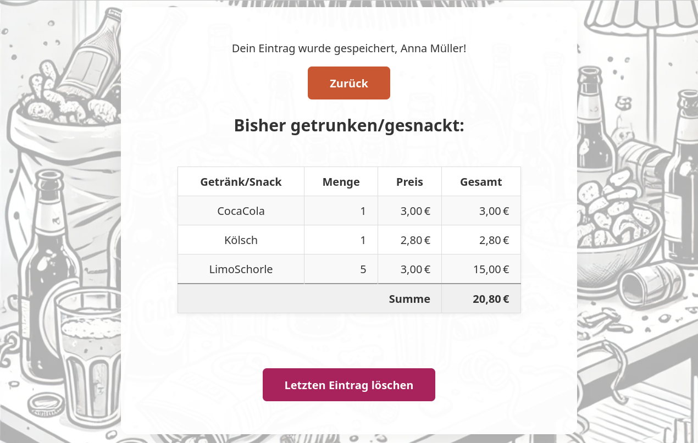
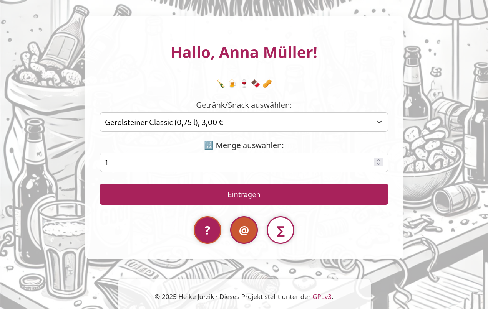

# tabkeeper

Eine schlanke Web-App zur Erfassung von Getränken und Snacks bei Veranstaltungen –
Verbrauch eintragen, individuelle Statistiken anzeigen und am Ende abrechnen.

Entstanden beim **Texttreff Wochenende (TTWW)**, einem Schreibwochenende für Frauen.
Die Person, die den Überblick über Getränke und Abrechnung behielt, wurde liebevoll
*Schluckwartin* genannt – daher der Name.

Geschrieben in Go, ohne Datenbank, ohne Framework – nur ein einzelnes Binary und
ein paar CSV-Dateien.

## Screenshots

## Screenshots




---

## Voraussetzungen

- Go 1.16 oder neuer (getestet mit Go 1.24 unter Debian Trixie)
- Ein Webserver oder eine Maschine, auf der ein Go-Binary laufen kann
- Ein Browser

---

## Installation

```bash
git clone https://github.com/huhnix/tabkeeper.git
cd tabkeeper
mkdir -p stats
```

---

## Konfiguration

### 1. Teilnehmerinnenliste

`users.txt` bearbeiten – ein Eintrag pro Zeile, Format: `benutzername=Vollständiger Name`

```
anna.mueller=Anna Müller
bettina.schmidt=Bettina Schmidt
```

Der Benutzername wird als URL-Slug verwendet: `/bar/anna.mueller`

### 2. Preisliste

Die `prices`-Map in `main.go` an die Getränke und Preise der eigenen Veranstaltung anpassen.

### 3. Hintergrundbild

`ksi-bg.jpg` durch ein eigenes Bild ersetzen oder den Verweis in `style.css` entfernen.

### 4. Passwort für die Abrechnung

In `main.go` eigene Zugangsdaten für die Abrechnungsseite setzen:

```go
const abrechnungUser = "schluckwartin"
const abrechnungPass = "geheim123"
```

---

## App starten

```bash
go run main.go
```

Die App läuft standardmäßig auf Port `8888`.

---

## Routen

| Route | Beschreibung |
|---|---|
| `/bar/<benutzername>` | Eingabeformular für eine Teilnehmerin |
| `/bar-view/<benutzername>` | Verbrauchsübersicht einer Teilnehmerin |
| `/bar-undo/<benutzername>` | Letzten Eintrag einer Teilnehmerin löschen |
| `/abrechnung` | Gesamtabrechnung (passwortgeschützt) |
| `/links` | – (statische Seite, siehe `links.html`) |

---

## Dateistruktur

```
tabkeeper/
├── main.go          # Anwendungslogik
├── style.css        # Stylesheet
├── users.txt        # Teilnehmerinnenliste (Dummy-Version im Repo)
├── links.html       # Statische Seite mit Links zu allen Bar-Seiten
├── favicon.png      # Favicon
├── ksi-bg.jpg       # Hintergrundbild
├── stats/           # Statistiken pro Nutzerin (generiert, nicht im Repo)
└── data-JJJJ-MM-TT.csv  # Tägliche Einträge (generiert, nicht im Repo)
```

---

## Lizenz

Copyright (C) 2025 Heike Jurzik

Dieses Programm ist freie Software, lizenziert unter der
[GNU General Public License v3.0](https://www.gnu.org/licenses/gpl-3.0.html).
